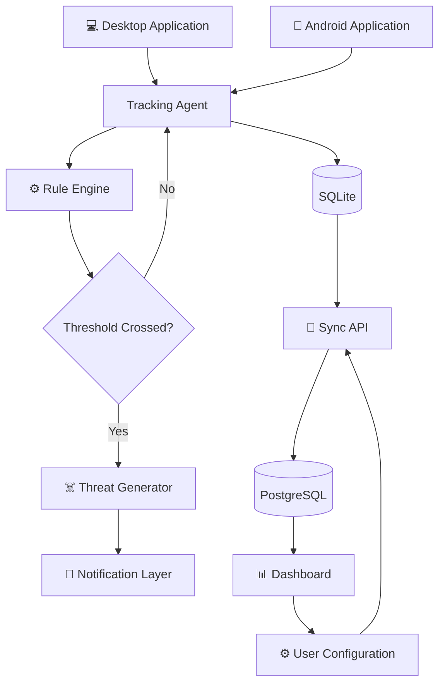
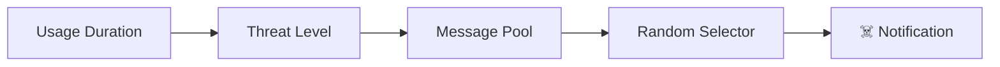
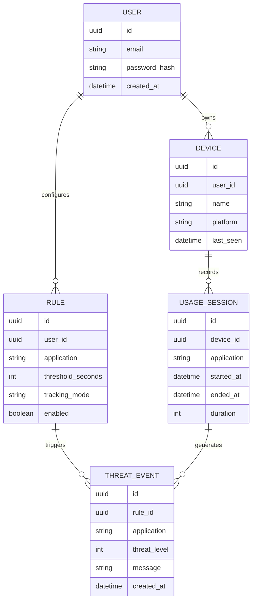
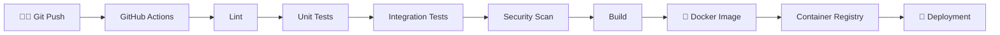

# ☠️ grimreaperX

<p align="center">
  
</p>

<p align="center">
  <strong>⏳ The longer you stay, the closer it gets.</strong>
</p>

<p align="center">
  A cross-platform digital discipline agent that monitors application usage,
  evaluates configurable thresholds, and delivers escalating randomized
  notifications when usage exceeds defined limits.
</p>

<p align="center">
  
  
  
  
  
  
</p>

---

## 🧠 Overview

**grimreaperX** is a background productivity and digital-wellbeing system built around a simple concept:

> **If you continue using an application beyond your configured limit, grimreaperX reacts.**

Instead of merely reporting screen-time statistics, the system actively monitors application usage, evaluates configurable rules, generates randomized threat messages, and escalates notifications as usage continues.

### ✨ Core Capabilities

- ⏱️ Real-time application usage tracking
- 🎯 Continuous and cumulative usage thresholds
- ☠️ Escalating threat levels
- 🎲 Randomized notification messages
- 🔔 Native notification delivery
- 💻 Desktop background agent
- 📱 Android tracking service
- 🔄 Cross-device synchronization
- 📊 Usage analytics and dashboard
- 🔐 Authentication and authorization
- 🐳 Docker-ready backend infrastructure
- 📈 Production-oriented observability

---

## ⚡ How It Works

```text
┌──────────────────────┐
│   Application Usage  │
└──────────┬───────────┘
           │
           ▼
┌──────────────────────┐
│    Tracking Agent    │
│                      │
│ • Detect active app  │
│ • Track duration     │
│ • Create sessions    │
└──────────┬───────────┘
           │
           ▼
┌──────────────────────┐
│      Rule Engine     │
│                      │
│ • Threshold checks   │
│ • Usage modes        │
│ • Cooldowns          │
└──────────┬───────────┘
           │
      Threshold?
       ┌───┴───┐
      NO       YES
       │         │
       │         ▼
       │  ┌──────────────────┐
       │  │ Threat Generator │
       │  └────────┬─────────┘
       │           │
       │           ▼
       │  ┌──────────────────┐
       │  │ Notification     │
       │  │ Delivery Layer   │
       │  └────────┬─────────┘
       │           │
       │           ▼
       │       ☠️ Warning
       │
       └───────────────► Continue Tracking
```

---

# 🏗️ Architecture



### System Components

| Component | Responsibility |
|---|---|
| 🖥️ Desktop Agent | Background application tracking |
| 📱 Android Service | Mobile usage monitoring |
| ⚙️ Rule Engine | Threshold and escalation evaluation |
| ☠️ Threat Generator | Randomized threat selection |
| 🔔 Notification Layer | Platform notification delivery |
| 💾 Local Storage | Offline-first usage persistence |
| 🔄 Sync API | Cross-device synchronization |
| 🐘 PostgreSQL | Centralized persistent storage |
| 📊 Dashboard | Analytics and configuration |

---

# ☠️ Threat Escalation

grimreaperX uses configurable escalation levels instead of repeatedly displaying the same message.

```text
NORMAL
  │
  ▼
🟢 LEVEL 1 — Reminder
  │
  ▼
🟡 LEVEL 2 — Warning
  │
  ▼
🟠 LEVEL 3 — Escalation
  │
  ▼
🔴 LEVEL 4 — Critical
  │
  ▼
☠️ LEVEL 5 — Final Threat
```

Example progression:

```text
20 min  → "You've been here for a while."
25 min  → "Maybe it's time to close this."
30 min  → "You're still here?"
35 min  → "Close the application."
40 min  → "grimreaperX has entered the chat."
```

Messages are selected from configurable message pools and can be randomized to reduce notification repetition.

---

# 🎲 Threat Generation



Example configuration:

```json
{
  "level": 1,
  "messages": [
    "You've been here for a while.",
    "Maybe it's time to close this.",
    "20 minutes already.",
    "The clock is still running."
  ]
}
```

---

# ⏱️ Usage Modes

## Continuous Usage

Tracks uninterrupted time spent inside an application.

```text
Application Opens
       │
       ▼
Timer Starts
       │
       ▼
Application Active
       │
       ├── Still Active ──► Timer Continues
       │
       └── Application Closed
                  │
                  ▼
             Session Ends
```

Example:

```text
YouTube
   │
   ├── 08 min
   ├── 12 min
   └── 20 min
          │
          ▼
     ☠️ Threshold
```

## Cumulative Usage

Combines multiple sessions during a configured period.

```text
Session 1 → 08 min
Session 2 → 06 min
Session 3 → 07 min
              │
              ▼
          21 minutes
              │
              ▼
       ☠️ Threshold Crossed
```

---

# 🖥️ Desktop Architecture

The desktop application uses **Tauri + Rust** for a lightweight background agent.

Responsibilities:

- Active-window detection
- Usage-session tracking
- Local rule evaluation
- Local persistence
- Notification triggering
- Synchronization
- Background execution

```text
┌─────────────────────────────┐
│      Tauri Application      │
├─────────────────────────────┤
│        Frontend UI          │
├─────────────────────────────┤
│       Tauri Commands        │
├─────────────────────────────┤
│          Rust Core          │
├─────────────────────────────┤
│      Tracking Service       │
├─────────────────────────────┤
│          SQLite             │
└─────────────────────────────┘
```

---

# 📱 Android Architecture

The Android client uses Kotlin and platform background capabilities.

```text
┌─────────────────────────────┐
│       Android Client        │
├─────────────────────────────┤
│       UI / Settings         │
├─────────────────────────────┤
│    Tracking Service         │
├─────────────────────────────┤
│    Usage Statistics API     │
├─────────────────────────────┤
│     Local Persistence       │
├─────────────────────────────┤
│      Notification API       │
└─────────────────────────────┘
```

The Android implementation requires the appropriate platform permissions for usage monitoring and notifications.

---

# 🔄 Synchronization

grimreaperX follows a local-first approach.

```text
              ┌──────────────┐
              │ Desktop      │
              └──────┬───────┘
                     │
                  SQLite
                     │
                     ▼
              ┌──────────────┐
              │  Sync Queue  │
              └──────┬───────┘
                     │
                     ▼
              ┌──────────────┐
              │   FastAPI    │
              └──────┬───────┘
                     │
                     ▼
              ┌──────────────┐
              │ PostgreSQL   │
              └──────┬───────┘
                     │
          ┌──────────┴──────────┐
          ▼                     ▼
      Android               Dashboard
```

The synchronization layer can handle:

- Device registration
- Usage events
- Rules
- User preferences
- Threat history
- Device state
- Offline queues
- Retry logic

---

# 📊 Dashboard

The dashboard provides centralized visibility and configuration.

Example interface:

```text
┌─────────────────────────────────────────────┐
│                  TODAY                      │
├─────────────────┬───────────────────────────┤
│ Screen Time     │ 04h 21m                   │
├─────────────────┼───────────────────────────┤
│ Threats         │ 17                        │
├─────────────────┼───────────────────────────┤
│ Devices         │ 3                         │
├─────────────────┼───────────────────────────┤
│ Most Used App   │ YouTube                   │
└─────────────────┴───────────────────────────┘
```

Potential dashboard capabilities:

- 📊 Usage overview
- 📈 Application trends
- 🗓️ Historical analytics
- ⚙️ Rule management
- 📱 Device management
- ☠️ Threat history
- 🔔 Notification configuration

---

# 🧩 Technology Stack

| Layer | Technology |
|---|---|
| 🖥️ Desktop | Tauri |
| 🦀 Desktop Core | Rust |
| 📱 Android | Kotlin |
| ⚙️ Backend | FastAPI |
| 🐍 Backend Language | Python |
| 💾 Local Database | SQLite |
| 🐘 Cloud Database | PostgreSQL |
| 🎨 Dashboard | React / compatible web frontend |
| 🔐 Authentication | JWT |
| 🔌 API | REST |
| 🐳 Containers | Docker |
| 🚀 CI/CD | GitHub Actions |
| 📊 Monitoring | Prometheus / Grafana |
| ☁️ Infrastructure | AWS / compatible cloud |

---

# 📁 Project Structure

```text
grimreaperX/
│
├── apps/
│   ├── desktop/
│   │   ├── src/
│   │   ├── src-tauri/
│   │   ├── migrations/
│   │   └── package.json
│   │
│   ├── android/
│   │   ├── app/
│   │   ├── services/
│   │   ├── notifications/
│   │   └── build.gradle
│   │
│   └── dashboard/
│       ├── src/
│       ├── components/
│       ├── pages/
│       └── package.json
│
├── backend/
│   ├── app/
│   │   ├── api/
│   │   ├── core/
│   │   ├── models/
│   │   ├── schemas/
│   │   ├── services/
│   │   └── main.py
│   │
│   ├── migrations/
│   ├── tests/
│   └── requirements.txt
│
├── shared/
│   ├── schemas/
│   ├── constants/
│   └── types/
│
├── infrastructure/
│   ├── docker/
│   ├── kubernetes/
│   ├── terraform/
│   └── monitoring/
│
├── docs/
│   ├── architecture/
│   ├── api/
│   └── security/
│
├── scripts/
├── tests/
│
├── .github/
│   └── workflows/
│
├── docker-compose.yml
├── Dockerfile
├── .env.example
├── LICENSE
└── README.md
```

---

# 🔐 Security

Security is treated as a first-class architectural concern.

```text
Client
  │
  ▼
HTTPS / TLS
  │
  ▼
Authentication
  │
  ▼
JWT Validation
  │
  ▼
Authorization
  │
  ▼
Request Validation
  │
  ▼
Service Layer
  │
  ▼
Database
```

### Security Controls

- 🔐 JWT authentication
- 🔑 Secure password hashing
- 🛡️ Authorization checks
- 🚫 Input validation
- 🧹 Parameterized database operations
- 🔒 HTTPS/TLS
- 🔐 Environment-based secrets
- 🚨 Rate limiting
- 📝 Audit logging
- 🔄 Token expiration
- 🧩 Least-privilege access

### Environment Configuration

Create a `.env` file from `.env.example`.

```env
DATABASE_URL=
JWT_SECRET=
JWT_ALGORITHM=
ACCESS_TOKEN_EXPIRE_MINUTES=
API_URL=
```

> Never commit production credentials or secrets to Git.

---

# 🗃️ Data Model



---

# 🔌 API

Example REST API structure:

```text
/api
│
├── /auth
│   ├── POST /register
│   ├── POST /login
│   └── POST /refresh
│
├── /users
│   └── GET /me
│
├── /devices
│   ├── GET /
│   ├── POST /
│   └── DELETE /{id}
│
├── /rules
│   ├── GET /
│   ├── POST /
│   ├── PATCH /{id}
│   └── DELETE /{id}
│
├── /usage
│   ├── POST /sessions
│   ├── GET /sessions
│   └── GET /summary
│
├── /threats
│   ├── GET /
│   └── GET /stats
│
└── /sync
    ├── POST /push
    └── GET /pull
```

FastAPI development documentation is available through:

```text
/api/docs
/api/redoc
```

---

# ⚙️ Configuration

Example rule:

```json
{
  "application": "youtube",
  "threshold": 1200,
  "mode": "continuous",
  "enabled": true,
  "escalation": {
    "enabled": true,
    "interval": 300
  },
  "notifications": {
    "enabled": true,
    "cooldown": 180
  }
}
```

| Setting | Description |
|---|---|
| `application` | Target application |
| `threshold` | Initial threshold in seconds |
| `mode` | Continuous or cumulative |
| `enabled` | Enable/disable rule |
| `escalation` | Enable escalation |
| `interval` | Escalation interval |
| `cooldown` | Notification cooldown |

---

# 🧪 Testing

grimreaperX is designed for layered testing.

```text
              ┌──────────────┐
              │  E2E Tests   │
              └──────┬───────┘
                     │
              ┌──────▼───────┐
              │ Integration  │
              └──────┬───────┘
                     │
              ┌──────▼───────┐
              │ Service Tests│
              └──────┬───────┘
                     │
              ┌──────▼───────┐
              │  Unit Tests  │
              └──────────────┘
```

Important test areas:

- Tracking accuracy
- Threshold detection
- Rule evaluation
- Threat escalation
- Notification cooldowns
- Authentication
- Authorization
- API validation
- Database operations
- Synchronization
- Conflict handling
- Device registration

Run backend tests:

```bash
pytest
```

---

# 🐳 Docker

Build containers:

```bash
docker compose build
```

Start the stack:

```bash
docker compose up -d
```

Check services:

```bash
docker compose ps
```

View logs:

```bash
docker compose logs -f
```

Stop services:

```bash
docker compose down
```

---

# 💻 Local Development

## Prerequisites

Install:

- Git
- Rust
- Node.js
- Python
- Android Studio
- Docker
- PostgreSQL

### Clone

```bash
git clone <YOUR_REPOSITORY_URL>
cd grimreaperX
```

---

## Backend

The API binds to `127.0.0.1` by default and only allows the local frontend origins `http://127.0.0.1:5173` and `http://localhost:5173` by default. Set `ALLOW_REMOTE=true` only for deployments that intentionally expose the API beyond the local machine. Custom CORS origins can be provided through `CORS_ORIGINS` as a comma-separated list.

The API also enforces a 64 KiB request-body limit and a default per-device rate limit of 60 requests per 60 seconds. These can be adjusted with `MAX_REQUEST_BYTES`, `RATE_LIMIT_REQUESTS`, and `RATE_LIMIT_WINDOW_SECONDS`.

Create a virtual environment:

```bash
python -m venv .venv
```

### Windows

```bash
.venv\Scripts\activate
```

### Linux / macOS

```bash
source .venv/bin/activate
```

Install dependencies:

```bash
pip install -r backend/requirements.txt
```

Start the API:

```bash
uvicorn backend.app.main:app --reload
```

---

## Desktop

```bash
cd apps/desktop
npm install
npm run tauri dev
```

Build:

```bash
npm run tauri build
```

---

## Android

Open:

```text
apps/android/
```

in Android Studio.

Then:

```text
Gradle Sync
     ↓
Build
     ↓
Install
     ↓
Run
```

The Android client requires the appropriate platform permissions for usage monitoring and notifications.

Usage Access is requested through Android system settings after the user taps the permission action. Once granted, the foreground service samples app transitions every five seconds, uses the shared escalation boundaries and `shared/threat_templates.json`, and stores normalized records in the app-private `files/usage_events.jsonl`. The JSON fields follow `shared/event.schema.json`; events remain on-device in this implementation. The monitor uses the `specialUse` foreground-service type because it is user-enabled continuous usage monitoring, not data synchronization. Google Play distribution requires a matching use-case declaration and policy review; the app does not use full-screen intents.

---

# 🚀 CI/CD

Recommended pipeline:



Pipeline stages can include:

- Formatting
- Static analysis
- Unit testing
- Integration testing
- Dependency scanning
- Container scanning
- Artifact generation
- Docker builds
- Deployment

---

# 📊 Observability

Production deployments should expose health, metrics, and logs.

```text
Application
    │
    ├──────────────► Logs
    │
    ├──────────────► Metrics
    │
    └──────────────► Health Checks
                           │
                           ▼
                  ┌─────────────────┐
                  │  Observability  │
                  ├─────────────────┤
                  │ Prometheus      │
                  │ Grafana         │
                  │ Central Logs    │
                  └─────────────────┘
```

Useful metrics:

- API latency
- API error rate
- Active devices
- Sync failures
- Usage events
- Notification events
- Database connections
- Background service health

---

# 🎬 Demo

Add actual recordings to the `assets/` directory.

### 🖥️ Desktop Agent

<p align="center">
  
</p>

### ☠️ Threat Escalation

<p align="center">
  
</p>

### 📊 Dashboard

<p align="center">
  
</p>

---

# 🖼️ Screenshots

Recommended asset structure:

```text
assets/
├── grimreaperx-banner.gif
├── demo-desktop.gif
├── threat-escalation.gif
├── dashboard.gif
├── dashboard-overview.png
├── rule-management.png
├── notification.png
└── mobile-app.png
```

Example:

<p align="center">
  
</p>

---

# 📈 Scalability

The backend can scale horizontally by separating API, synchronization, and background processing workloads.

```text
                    ┌───────────────┐
                    │ Load Balancer │
                    └───────┬───────┘
                            │
             ┌──────────────┼──────────────┐
             ▼              ▼              ▼
          API #1          API #2          API #3
             │              │              │
             └──────────────┼──────────────┘
                            │
                            ▼
                     ┌─────────────┐
                     │ Message Bus │
                     └──────┬──────┘
                            │
              ┌─────────────┼─────────────┐
              ▼             ▼             ▼
          Worker #1     Worker #2     Worker #3
                            │
                            ▼
                       PostgreSQL
```

This architecture can accommodate growth in:

- 👤 Users
- 📱 Devices
- ⏱️ Usage events
- ⚙️ Rules
- 🔔 Notifications
- 🔄 Synchronization requests

---

# 🛡️ Privacy

grimreaperX is intended to collect only the information necessary for application usage monitoring and synchronization.

Potentially processed data includes:

- Application names
- Usage duration
- Session timestamps
- Device identifiers
- User configuration
- Threat events

The tracking agent should **not** collect:

- Keystrokes
- Passwords
- Application contents
- Personal files
- Clipboard contents

> **grimreaperX tracks application usage — not what you do inside the application.**

---

# 🧭 Roadmap

### Platform

- [x] Desktop tracking architecture
- [x] Android tracking architecture
- [ ] Additional desktop platform support
- [ ] Expanded mobile support
- [ ] Additional notification integrations

### Intelligence

- [ ] Adaptive threat scheduling
- [ ] Usage pattern detection
- [ ] Personalized thresholds
- [ ] Behavioral analytics
- [ ] Smart escalation

### Infrastructure

- [ ] Production cloud deployment
- [ ] Horizontal API scaling
- [ ] Distributed event processing
- [ ] Advanced observability
- [ ] Automated disaster recovery

### Dashboard

- [ ] Advanced analytics
- [ ] Usage heatmaps
- [ ] Application trends
- [ ] Device comparison
- [ ] Custom dashboards

---

# 🤝 Contributing

Contributions are welcome.

### 1. Fork

```bash
git clone <YOUR_REPOSITORY_URL>
cd grimreaperX
```

### 2. Create a branch

```bash
git checkout -b feature/my-feature
```

### 3. Make your changes

Follow the existing architecture and coding conventions.

### 4. Run tests

```bash
pytest
```

### 5. Commit

```bash
git add .
git commit -m "feat: add my feature"
```

### 6. Push

```bash
git push origin feature/my-feature
```

### 7. Open a Pull Request 🚀

---

# 📜 License

This project is licensed under the **MIT License**.

See [`LICENSE`](LICENSE) for details.

---

# ⚠️ Disclaimer

grimreaperX is a productivity and digital-wellbeing project.

The notification system intentionally uses fictional, randomized "threat" messaging as a behavioral feedback mechanism.

Users should configure notification frequency and intensity responsibly.

---

# 🖤 Philosophy

```text
┌──────────────────────────────────────┐
│                                      │
│          TIME IS LIMITED.            │
│                                      │
│          YOUR APPS ARE NOT.          │
│                                      │
│             ☠️ grimreaperX           │
│                                      │
└──────────────────────────────────────┘
```

> **Track less. Live more. Before the Reaper notices.**

---

<p align="center">
  <strong>☠️ grimreaperX</strong>
  <br>
  Your screen time has consequences.
  <br><br>
  Built with 🖤, Rust, Python, Kotlin & too much screen time.
</p>
